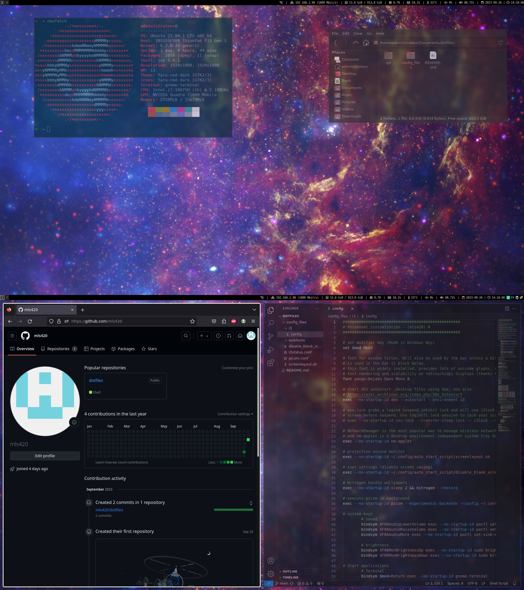

# i3wm Dotfiles Configuration

Welcome to my i3wm dotfiles repository! This collection of configuration files and scripts represents the heart of my Linux desktop environment setup, centered around the versatile i3 window manager with gaps.



In this repository, you'll find meticulously crafted configuration files for i3wm, picom (for window transparency and effects), rofi (for application launching), thunar (as my lightweight file manager), and other essential tools like Vim, Git, and GIMP, each tailored to create a seamless and productive computing experience.

These dotfiles not only set up the appearance and behavior of my workspace but also include instructions for installing and configuring critical components like Airblader's i3-gaps, Visual Studio Code, betterlock, and touchpad settings for natural scrolling and tap to click.

Beyond aesthetics, these dotfiles aim to boost productivity. You'll find shortcuts, keybindings, and features that help streamline tasks and provide a smooth, efficient workflow.

Additionally, I've included steps to mute the system bell, an often-appreciated tweak for a more peaceful working environment, and instructions for installing the AwesomeFont, which adds an extra layer of customization to the user interface.

If you're looking to replicate or draw inspiration from my i3wm setup, you're in the right place. These dotfiles are a product of continuous refinement and optimization, and I'm excited to share them with you. Please review the documentation and installation instructions below to get started.

If you have any questions, suggestions, or encounter any issues, don't hesitate to reach out. I'm here to help you make the most of your i3wm experience. Let's dive in and elevate your Linux desktop environment together!

I can certainly help you with a tutorial to set up an i3wm environment on Ubuntu and perform the tasks you mentioned. Please note that my knowledge is based on information available up to September 2021, so there may have been updates or changes in software and package availability since then. Let's get started!

### Essential Software Setup

**Step 1: Install Essential Programs**

Open a terminal and run the following command to install the essential programs:

```bash
sudo apt update
sudo apt install i3 vim git meson gimp arandr nitrogen picom rofi thunar brightnessctl 
```

Explanation:
- `i3`: i3 Window Manager is the core component of your window manager setup.
- `vim`: A highly configurable, efficient, and powerful text editor.
- `git`: A version control system for tracking changes in your projects.
- `meson`: A build system used for i3-gaps and some other software.
- `gimp`: The GNU Image Manipulation Program, a powerful image editor.
- `arandr`: A graphical interface for managing screen resolutions.
- `nitrogen`: A background browser and setter for X11 window managers.
- `picom`: A compositor for X11, used for enabling window transparency and effects.
- `rofi`: A window switcher, application launcher, and dmenu replacement.
- `thunar`: A lightweight file manager.
- `brightnessctl`: A utility for controlling display brightness.
- `lxappearance`: Lxappearance is a graphical tool for customizing the theme and appearance of your desktop.
- `vlc`: VLC is a versatile multimedia player capable of playing various media formats.

**Step 2: Install i3-gaps (Airblader's version)**

To install i3-gaps, you'll need to compile it from source. Follow these commands:

```bash
sudo apt install libxcb1-dev libxcb-keysyms1-dev libpango1.0-dev \
libxcb-util0-dev libxcb-icccm4-dev libyajl-dev \
libstartup-notification0-dev libxcb-randr0-dev \
libev-dev libxcb-cursor-dev libxcb-xinerama0-dev \
libxcb-xkb-dev libxkbcommon-dev libxkbcommon-x11-dev \
autoconf libxcb-xrm0 libxcb-xrm-dev automake libxcb-shape0-dev \
libstartup-notification0-dev

git clone https://github.com/Airblader/i3.git i3-gaps

cd i3-gaps

mkdir -p build && cd build

meson ..

ninja

sudo ninja install
```

**Step 3: Install Visual Studio Code**

You can install Visual Studio Code (VSCode) using Snap, a package manager:

```bash
sudo snap install --classic code
```

**Step 4: Install i3lock-color**

i3lock-color allows you to create custom lock screens with various features, and ImageMagick provides essential tools for image processing and manipulation.

Run this command to install all dependencies:
```bash
sudo apt install autoconf gcc make pkg-config libpam0g-dev libcairo2-dev libfontconfig1-dev libxcb-composite0-dev libev-dev libx11-xcb-dev libxcb-xkb-dev libxcb-xinerama0-dev libxcb-randr0-dev libxcb-image0-dev libxcb-util-dev libxcb-xrm-dev libxkbcommon-dev libxkbcommon-x11-dev libjpeg-dev
```
To build/install i3lock-color, first install the dependencies listed above, then clone the repo:
```bash
git clone https://github.com/Raymo111/i3lock-color.git
cd i3lock-color
```
To build without installing, run:
```bash
./build.sh
```
To build AND install, run:
```bash
./install-i3lock-color.sh
```

**Step 5: Configure touchpad for natural scrolling and tap to click**

To configure your touchpad, you can create a custom Xorg configuration file. Create a new file, e.g., `/etc/X11/xorg.conf.d/90-touchpad.conf`, and add the following content:

```bash
Section "InputClass"
    Identifier "touchpad"
    Driver "libinput"
    MatchIsTouchpad "on"
    Option "NaturalScrolling" "true"
    Option "Tapping" "true"
EndSection
```

Restart your X session or reboot for the changes to take effect.

**Step 6: Mute the system bell**

To mute the system bell, you can add the following line to your `~/.Xresources` file:

```bash
xset -b
```

After saving the file, reload your X resources with:

```bash
xrdb ~/.Xresources
```

Certainly! Here's how to change your desktop wallpaper in i3wm using the GUI interface provided by `nitrogen`:

**Step 7: Change Wallpaper Using GUI (Nitrogen)**

1. Open a terminal and run the `nitrogen` command to launch the Nitrogen wallpaper manager:

   ```bash
   nitrogen
   ```

   This will open the Nitrogen GUI interface.

2. In the Nitrogen window, click the "Add" button to browse your computer for a new wallpaper image. Navigate to the location of your desired wallpaper image and select it.

3. Once you've selected the wallpaper image, you can choose how you want to display it from the "Mode" dropdown menu. Common options include:
   
   - "Fill Screen" to scale the image to fit your screen.
   - "Full Screen" to display the image without scaling.
   - "Centered" to center the image on the screen.
   - "Tile" to repeat the image across the screen.

4. After configuring the display mode, click the "Apply" button to set the selected image as your wallpaper.

5. To make this wallpaper change persistent across reboots, click the "Preferences" button in the Nitrogen window.

6. In the Preferences window, go to the "Nitrogen Preferences" tab and check the box that says "Automatically restore last wallpaper."

7. Click the "OK" button to save your preferences.

8. Close the Nitrogen window.
---
Now, you've successfully changed your wallpaper using the Nitrogen GUI interface in your i3wm environment. The wallpaper will persist across reboots because you configured Nitrogen to automatically restore the last wallpaper.

That's it! You've successfully set up i3-gaps with your desired programs and configurations on Ubuntu. Remember to customize your configurations further to suit your preferences.

### Copy Configuration Files

**Step 1: Copy the i3 Configuration**

```bash
cp i3/config ~/.config/i3/
```

This command copies the `config` file from the `i3` directory to `~/.config/i3/`, which is where i3wm expects its configuration file.

**Step 2: Copy the i3status Configuration**

```bash
sudo cp i3status.conf /etc/
```

This command copies the `i3status.conf` file to the `/etc/` directory, which is the system-wide location for i3status configuration.

**Step 3: Copy the Picom Configuration**

```bash
cp picom.conf ~/.config/
```

This command copies the `picom.conf` file to `~/.config/`, where picom (the compositor) expects its configuration.

**Step 4: Create the `auto_start_script` Directory and Copy Scripts**

```bash
mkdir -p ~/.config/auto_start_script
cp disable_blank_screen.sh ~/.config/auto_start_script/
cp screenlayout.sh ~/.config/auto_start_script/
```

Here, we first create the `auto_start_script` directory in `~/.config/` using `mkdir -p`, and then we copy the `disable_blank_screen.sh` and `screenlayout.sh` scripts into that directory.

**Step 5: Install AwesomeFont**

You can install AwesomeFont by placing the font files in your `~/.fonts` directory.

Now, you have successfully copied the necessary configuration files and scripts to their respective locations as specified in your instructions. These files are ready for use in your i3wm environment.